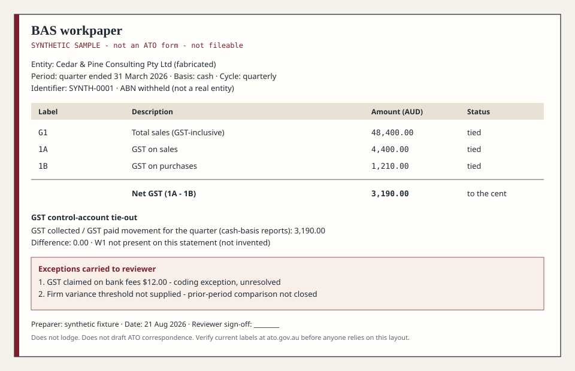

# Australian Accounting Skills: show the BAS tie-out

Synthetic example. Prep-only workflow aids. An authorised human reviews, decides and lodges. These skills do not provide tax advice or replace professional judgement.

**Input:** a fabricated quarterly cash-basis BAS with GST collected of $4,400.00 and GST paid of $1,210.00, plus the matching GST control-account movement.

Install the portable skill files: `npx skills add ryanduguid/australian-accounting-skills`

An agent runtime is still required. Ask it to prepare the BAS workpaper from the supplied reports and show the GST control-account tie-out.

**Output:** net GST of $3,190.00 ties to the $3,190.00 movement, with exceptions retained and reviewer sign-off blank.

**Human decision:** Resolve the coding exceptions and confirm the reporting basis and evidence before signing off.

Installation, worked example, skill catalogue and boundaries

## Runtime and release

Claude Code is the tested runtime. Codex packaging and portable skill files are included. That does not establish testing in every agent runtime.

[v0.2.1](https://github.com/ryanduguid/australian-accounting-skills/releases/tag/v0.2.1) contains nineteen practice and contracting workflows. The command above resolves the default branch, which may be newer. [Installation](docs/installation.md) includes the tagged path and the Hardhat Ledger collision warning.

[CITATION.cff](CITATION.cff) remains pinned to v0.1.5, the original nine-skill practice pack. The [Hardhat consolidation record](docs/HARDHAT-CONSOLIDATION.md) explains the expanded inventory.

## Reference

- [Install, uninstall and versioning](docs/installation.md)
- [First run and BAS walkthrough](docs/bas-walkthrough.md)
- [Nineteen skills and their supporting files](docs/skill-catalogue.md)
- [Related command-line tools](docs/integrations.md)
- [Fabricated validation pack](validation/README.md) and [evaluation method](docs/EVAL.md)
- [Contributor checks](AGENTS.md) and [professional boundary](DISCLAIMER.md)
- [Discovery and GitHub About copy](docs/DISCOVERY.md)

Skills specify the workflow and require current primary authority for mutable rates, thresholds, labels and due dates. Keep real client files in the firm's approved environment, outside this repository.

Ryan Duguid, accountant in Newcastle NSW, provisional member of Chartered Accountants ANZ.

MIT: [LICENSE](LICENSE). Provenance: [NOTICE](NOTICE).

